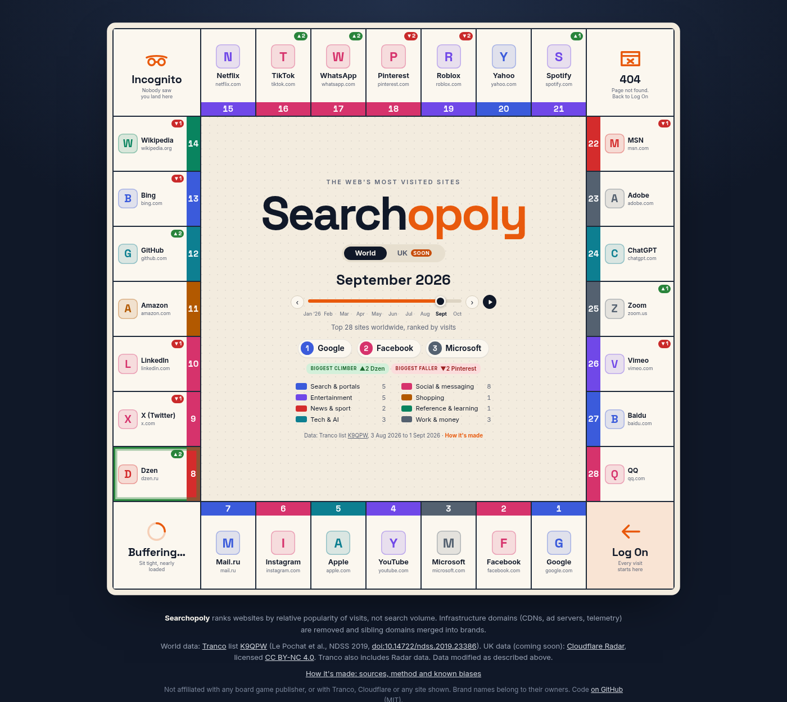
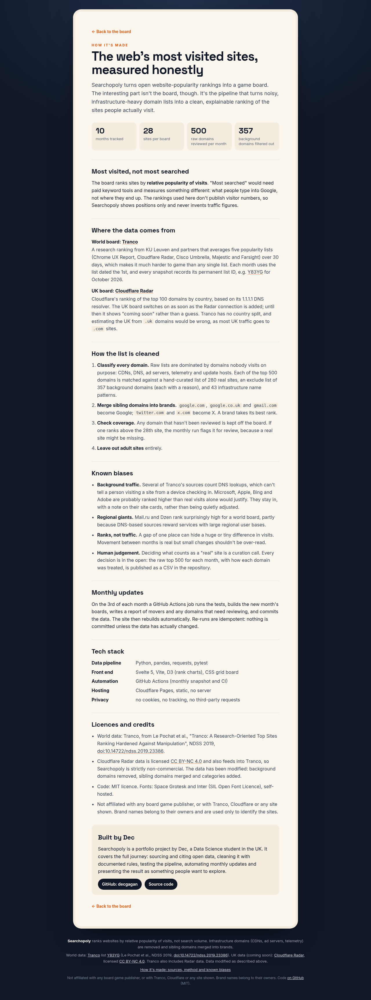

# Searchopoly

**An interactive board game-style map of the web's most visited websites, for the UK and the world, updated every month.**

Searchopoly takes public website popularity rankings, strips out the background noise
(CDNs, ad servers, telemetry), merges sibling domains into the brands people actually
recognise, and lays the top 28 out as squares on a game board. Categories are the colour
sets, and a month slider shows who climbed and who fell. A "How it's made" page
(`#about`) explains the method, the known biases and the credits.

It's a data science portfolio project: the interesting part is the pipeline that turns
messy, infrastructure-heavy domain rankings into an honest, explainable list of sites.

> **Status:** all five milestones are built in code. The site goes live at
> [searchopoly.co.uk](https://searchopoly.co.uk) once the steps in [LAUNCH.md](LAUNCH.md) are done.


<p>
  
  
</p>
<p>
  
  
</p>

## What it measures (and what it doesn't)

Searchopoly ranks sites by **relative popularity of visits**, not by search volume.
"Most searched" needs paid keyword tools; "most visited" can be estimated from free,
well-documented research rankings. Ranks are relative. Neither source publishes visitor
counts, so the board never claims numbers it can't back up.

## October 2026: World board

From [Tranco list Y83YG](https://tranco-list.eu/list/Y83YG) (dated 1 October 2026, covering 2 September to 1 October 2026).
`Source rank` is the brand's best position in the raw list before cleaning; `vs Sep` is the change in board position.

| # | Site | Category | Source rank | vs Sep |
|---|------|----------|-------------|--------|
| 1 | Google | search | 1 | = |
| 2 | Facebook | social | 3 | = |
| 3 | Microsoft | productivity | 8 | = |
| 4 | YouTube | video | 9 | = |
| 5 | Apple | tech | 10 | = |
| 6 | Instagram | social | 11 | = |
| 7 | Mail.ru | search | 12 | = |
| 8 | X (Twitter) | social | 15 | +1 |
| 9 | Dzen | news | 17 | -1 |
| 10 | LinkedIn | social | 18 | = |

The full 28 are in [`data/snapshots/2026-10/world.json`](data/snapshots/2026-10/world.json).
Every one of the top 500 raw domains, and how it was treated, is in
[`world_ranked_top500.csv`](data/snapshots/2026-10/world_ranked_top500.csv).

The **UK board is pending** until a Cloudflare Radar API token is added (see below).

## How the pipeline works

```
Tranco top 5,000 ──┐                       ┌─> data/snapshots/YYYY-MM/world.json
                   ├─> classify ─> merge ──┤
Radar top 100 (GB)─┘   (map /     brands   ├─> data/snapshots/YYYY-MM/uk.json
                        exclude /  + top 28 ├─> ..._ranked_top500.csv  (transparency)
                        patterns)           └─> data/latest.json       (index for the site)
```

1. **Fetch.** For month `YYYY-MM`, the [Tranco](https://tranco-list.eu) list dated `YYYY-MM-01`
   (World) and the [Cloudflare Radar](https://radar.cloudflare.com/domains) top 100 for
   `location=GB` on the same date (UK). Pinning every month to the list from the 1st keeps months
   comparable and each snapshot reproducible from its list ID. Only the first 5,000 Tranco rows are
   downloaded, never the full million. Tranco's API limit (1 request/second) is respected.
2. **Classify.** Every domain is one of:
   - `mapped`: in [`pipeline/data/site_map.csv`](pipeline/data/site_map.csv), a hand-curated
     list of real destinations with brand, canonical domain and category;
   - `excluded`: in [`pipeline/data/exclude.csv`](pipeline/data/exclude.csv) (with a reason)
     or matching an infrastructure name pattern (`cdn`, `dns`, `akamai`, `googleapis` ...);
   - `unreviewed`: anything else. These never appear on a board.
3. **Merge.** Sibling domains collapse into one brand that takes its best rank:
   `google.com` + `google.co.uk` + `gmail.com` → Google; `twitter.com` + `x.com` → X;
   `office.com` + `live.com` + `outlook.com` → Microsoft.
4. **Check coverage.** If any unreviewed domain outranks the 28th site, the run warns,
   because the board might be missing a real site. Every month from January to October 2026 is
   fully reviewed to raw rank 500.
5. **Write.** Small JSON files for the front end. Each site has a stable `id` (brand slug) and an
   optional `note`, plus `previous_rank` and `movement` once there's an earlier month to compare against.

### Curation rules

- **Include** a domain if people mainly reach it on purpose: typing it, opening its app or following a link.
- **Exclude** background traffic: CDNs, DNS and certificates, ad and analytics servers, app and
  device telemetry, OS update hosts, link shorteners, registrars and hosting platforms.
- **Adult sites are excluded entirely.**
- Where a brand mixes real visits with background traffic (e.g. `microsoft.com`, `apple.com`),
  it stays in. That's a known bias of DNS-based rankings, and it's documented rather than hidden.

### Categories and colour sets

18 categories roll up into 8 colour groups, defined in
[`pipeline/data/categories.csv`](pipeline/data/categories.csv):
Search & portals · Social & messaging · Entertainment · Shopping · News & sport ·
Reference & learning · Tech & AI · Work & money.

## Running it

Requires Python 3.11+ for the pipeline and Node.js 20.19+ (22 recommended) for the website.

### Data pipeline

```bash
python -m venv .venv
source .venv/bin/activate          # Windows: .venv\Scripts\activate
pip install -r requirements-dev.txt

python -m pipeline.run                         # this month's snapshot
python -m pipeline.run --month 2026-09         # a specific month
python -m pipeline.run --backfill 2026-01:2026-10   # a range, oldest first
pytest                                         # run the tests
```

Re-runs are idempotent: a file is only rewritten when its data changes (timestamps are ignored).
Each run ends with a report covering the top 5, the biggest movers, coverage and any **unreviewed
domains** to curate.

### Historical data

The ten World snapshots (January to October 2026) are genuine: each was built from the real
Tranco list dated the 1st of that month, using the same cleaning rules. List IDs are recorded in
every snapshot:

| Month | Tranco list | Month | Tranco list |
|---|---|---|---|
| 2026-01 | [VQ3PN](https://tranco-list.eu/list/VQ3PN) | 2026-06 | [334VL](https://tranco-list.eu/list/334VL) |
| 2026-02 | [3Q9NL](https://tranco-list.eu/list/3Q9NL) | 2026-07 | [JZ2VY](https://tranco-list.eu/list/JZ2VY) |
| 2026-03 | [VQPQN](https://tranco-list.eu/list/VQPQN) | 2026-08 | [V3JQN](https://tranco-list.eu/list/V3JQN) |
| 2026-04 | [NNQ7W](https://tranco-list.eu/list/NNQ7W) | 2026-09 | [K9QPW](https://tranco-list.eu/list/K9QPW) |
| 2026-05 | [GV93K](https://tranco-list.eu/list/GV93K) | 2026-10 | [Y83YG](https://tranco-list.eu/list/Y83YG) |

### Website

```bash
cd web
npm install
npm run dev        # local dev server at http://localhost:5173
npm run build      # production build into web/dist
npm run preview    # serve the production build
npm run og         # after a build: redraw public/og.png (the 1200x630 share image) from the real board
npm run icons      # redraw the PNG favicons and app icons from public/favicon.svg
```

`og` and `icons` use headless Chrome through `playwright-core` (no browser download; set
`CHROME_PATH` if Chrome isn't in a standard place). The share image is the `#og` view of the
site itself: the title, the month's top five and the board, screenshotted at 1200x630. Cloudflare
Pages can't run Chrome, so `og.png` is committed. The monthly workflow redraws it whenever the
data changes.

`npm run dev` and `npm run build` first run `scripts/copy-data.mjs`, which copies the
pipeline's JSON output from `data/` into `web/public/data/` (git-ignored). The site loads
`data/latest.json` at runtime, so a new monthly snapshot needs only a rebuild, not a code change.
The URL hash holds the state, so any view can be shared:

| URL | Shows |
|-----|-------|
| `/` or `#world` | World board, latest month |
| `#uk` | UK board ("coming soon" until `uk.json` exists) |
| `#world/2026-06` | World board for June 2026 |
| `#world/google`, `#world/2026-06/chatgpt` | A board with a site card open (IDs are brand slugs, e.g. `x-twitter`) |
| `#about` | "How it's made": method, sources, curation, biases, licences, tech stack |

The UK board switches on automatically as soon as the pipeline writes `uk.json` and marks it
`ok` in `latest.json`. No front-end change is needed.

### Deploying to Cloudflare Pages

Step-by-step launch instructions (Pages, custom domain, token, going public) are in
[LAUNCH.md](LAUNCH.md). The build settings are:

| Setting | Value |
|---------|-------|
| Framework preset | None |
| Root directory | *(leave blank: repo root)* |
| Build command | `npm ci --prefix web && npm run build --prefix web` |
| Build output directory | `web/dist` |
| Environment variables | `NODE_VERSION=22`, `SKIP_DEPENDENCY_INSTALL=true` (skips the pipeline's Python deps) |

`web/public/` also holds `_headers` (security headers, a self-only CSP, long caching for hashed
assets), `404.html` (served by Pages for unknown paths; views live in the hash, so real pages
never 404), `robots.txt`, `sitemap.xml`, `site.webmanifest`, the icons and `og.png`.
`index.html` carries the title, description, canonical URL (`https://searchopoly.co.uk/`),
Open Graph and Twitter card tags, and JSON-LD.

The build needs no secrets: the Radar token is only used by the pipeline, never by the site.

## Automation (GitHub Actions)

| Workflow | When | What it does |
|----------|------|--------------|
| [`monthly.yml`](.github/workflows/monthly.yml) | 04:17 UTC on the 3rd of each month, or by hand | Runs the tests, then `python -m pipeline.run`. If the data changed, it builds the site and redraws `web/public/og.png`, then commits `data/` and `og.png` to `main` (as `github-actions[bot]`). Re-runs with no new data commit nothing. The push triggers a Cloudflare Pages rebuild. |
| [`ci.yml`](.github/workflows/ci.yml) | Every push to `main` and every pull request | Runs `pytest` and builds the website. |

The monthly run writes its report to the **job summary** (open the run in the Actions tab).
Unreviewed domains that could belong on a board show up there as a warning and as a workflow
annotation. To fix one, add the domain to `pipeline/data/site_map.csv` (a real site) or
`pipeline/data/exclude.csv` (background traffic), push, and re-run the workflow.

To run it by hand: **Actions → Monthly snapshot → Run workflow** (optionally with a month such
as `2026-09`), or `gh workflow run monthly.yml -f month=2026-09`.

### Adding the Cloudflare Radar token (UK board)

1. Create the token as described in "Enabling the UK board" above (Account → Radar → Read).
2. In the GitHub repo go to **Settings → Secrets and variables → Actions → New repository
   secret**, name it `CLOUDFLARE_API_TOKEN` and paste the token. Or, from a terminal:
   `gh secret set CLOUDFLARE_API_TOKEN --repo decgagan/searchopoly`.
3. Run the monthly workflow by hand once. The UK board appears on the site after the next deploy.

Without the secret the workflow still succeeds; the UK board just stays "coming soon".

### Enabling the UK board (Cloudflare Radar)

1. Create a free Cloudflare account, then go to **My Profile → API Tokens → Create Token →
   Custom token** and give it the **Account → Radar → Read** permission.
2. Run with the token in your environment (never commit it):
   ```bash
   export CLOUDFLARE_API_TOKEN=your_token_here
   python -m pipeline.run
   ```
Without a token the pipeline still builds the World board and marks the UK as `pending` in
`data/latest.json`. Tranco has no country split, and guessing a UK list from `.uk` domains
would be misleading (most UK traffic goes to `.com` sites), so there's no fake fallback.

## Data sources, credit and licences

| Source | Used for | Licence and attribution |
|--------|----------|-------------------------|
| [Tranco](https://tranco-list.eu) | World board | Free research ranking. Each list has a permanent ID, recorded in every snapshot. The authors ask users to cite: Victor Le Pochat, Tom Van Goethem, Samaneh Tajalizadehkhoob, Maciej Korczyński and Wouter Joosen, "Tranco: A Research-Oriented Top Sites Ranking Hardened Against Manipulation", *NDSS 2019*, [doi:10.14722/ndss.2019.23386](https://doi.org/10.14722/ndss.2019.23386). Tranco combines rankings from Cisco Umbrella, Majestic (CC BY 3.0), Farsight, the Chrome UX Report and Cloudflare Radar (CC BY-NC 4.0). |
| [Cloudflare Radar](https://radar.cloudflare.com/domains) | UK board | API data is licensed [CC BY-NC 4.0](https://creativecommons.org/licenses/by-nc/4.0/): attribution required, **non-commercial use only**, and changes must be indicated. Cloudflare's trademarks and Radar's look and feel are not licensed. |

**What this means for Searchopoly:**
- The project is non-commercial. Because Radar data is CC BY-NC (and also feeds into Tranco),
  the site shouldn't carry ads or be monetised without first checking with the data owners.
- The data has been **modified**: infrastructure domains removed, sibling domains merged and
  categories added. The method page (`#about`) says so alongside the credits.
- Searchopoly is not affiliated with or endorsed by Tranco, Cloudflare, or any site shown.
  Brand names belong to their owners and are used only to identify the sites.
- The board design is original. Searchopoly is not affiliated with any board game publisher.

## Roadmap

- [x] **1. Pipeline and first snapshot.** Tranco and Radar fetchers, curated cleaning, World board for October 2026, tests.
- [x] **2. Static board.** Svelte 5 + Vite. 28 squares in 8 colour sets plus 4 original corner squares, centre panel with month, top three, legend and credits; UK "coming soon" state.
- [x] **3. Interaction.** Site cards (rank, movement, category, raw rank, merged domains, notes on known biases), keyboard support, shareable URL hashes, UK/World toggle with URL state, mobile layout.
- [x] **4. Movement.** Month slider with play button; squares and list rows glide to their new positions (FLIP animation, off under reduced motion); ▲/▼/NEW badges, biggest climber and faller, a rank-over-time sparkline on each card; ten months of real backfilled data; monthly and CI GitHub Actions workflows.
- [x] **5. Launch (code).** "How it's made" method page with full credits; Open Graph/Twitter tags and a share image drawn from the real board each month; favicon and app icons; Share button on site cards (Web Share API, copy-link fallback); robots.txt, sitemap, 404 page, security headers. Lighthouse: 100/100/100/100 on desktop, 99/100/100/100 on mobile.
- [ ] **Go live.** Cloudflare Pages, custom domain, Radar token, public repo: see [LAUNCH.md](LAUNCH.md).

## Front-end design notes

- **Board:** a 9×9 CSS grid. The 28 sites run clockwise from the **Log On** corner, 7 per side,
  so #1 sits next to the start. The other corners are **Buffering…**, **Incognito** and **404**.
  All names, icons and artwork are original.
- **Icons:** each site shows a coloured initial rather than its favicon. Loading favicons from a
  third-party service at runtime would leak visitors' data to that service and depend on its
  terms; bundling trademarked logos raises licensing questions. Initials keep the site
  self-contained, private and consistent. Locally cached favicons could be added later.
- **Fonts:** Space Grotesk and Inter (SIL Open Font License), self-hosted via Fontsource, so no
  requests go to Google Fonts.
- **No tracking, no cookies, no external requests** at runtime.
- **Site cards:** a native modal `<dialog>`. Esc or a backdrop click closes it, Tab is trapped
  inside, ←/→ step through the ranks, and focus goes back to the square that opened it. Movement
  reads "First month tracked" until a second snapshot exists, then "New this month",
  "Up 3 places" and so on. Notes come from the optional `note` column in `site_map.csv` and flag
  known biases (e.g. Windows background traffic inflating Microsoft).
- **Months:** every month of a board is loaded up front (a few KB each), so the slider is instant.
  Sites are keyed by ID, so changing month moves each square to its new position using Svelte's
  FLIP animation. Sites joining or leaving the top 28 fade in and out. The biggest climber gets a
  pulsing outline. With `prefers-reduced-motion`, everything jumps straight to the new state.
- **Sparkline:** each card plots the site's rank by month (D3 scales and line generator), with
  gaps for months it was off the board.
- **Sharing:** the card's Share button opens the device share sheet (Web Share API) with the
  card's URL, e.g. `searchopoly.co.uk/#world/github`. Where that isn't available it copies the
  link and says "Link copied".
- **Accessibility and colour:** colour-set and movement colours meet WCAG AA contrast against
  the cream squares. Squares and rows are buttons whose accessible name starts with the visible
  text (rank, brand, domain), followed by visually hidden context. The app waits for data and
  fonts before drawing, so nothing jumps about (layout shift 0).
- **Mobile (≤700px):** the centre panel moves to the top, followed by a ranked list that keeps the
  colour bands. Site cards open as a bottom sheet.

## Project layout

```
web/
  src/App.svelte        # loads data, footer credits
  src/lib/Board.svelte  # desktop board grid
  src/lib/CentrePanel.svelte # title, toggle, top three, legend, source
  src/lib/MobileList.svelte  # mobile ranked list
  src/lib/SiteCard.svelte    # site card dialog and Share button
  src/lib/About.svelte       # "How it's made" page (#about)
  src/lib/OgCard.svelte      # 1200x630 share-image layout (#og)
  src/lib/MonthPicker.svelte # month slider and play button
  src/lib/Sparkline.svelte   # rank-over-time chart on the card
  src/lib/movement.js        # movement badges and movers summary
  src/lib/router.js     # URL hash state
  src/lib/Square.svelte # one property square
  src/lib/Corner.svelte # the four corner squares
  src/lib/layout.js     # square positions, corner names
  src/lib/groups.js     # the 8 colour sets
  scripts/copy-data.mjs # copies data/ into the build
  scripts/og-image.mjs  # npm run og: screenshots #og into public/og.png
  scripts/icons.mjs     # npm run icons: PNG icons from favicon.svg
  public/               # favicon, icons, og.png, _headers, 404.html, robots.txt, sitemap.xml
pipeline/
  run.py          # entry point: python -m pipeline.run
  tranco.py       # Tranco list metadata and download
  radar.py        # Cloudflare Radar ranking API client
  clean.py        # classify, merge brands, coverage check
  snapshot.py     # JSON/CSV writers and the latest.json index
  report.py       # run report, job summary and warnings
  data/           # hand-curated site_map.csv, exclude.csv, categories.csv
data/
  latest.json     # index the front end loads first
  snapshots/YYYY-MM/
tests/            # pytest suite: cleaning, Radar client, movement, run report
.github/workflows # monthly snapshot job and CI
```

## Licence

Code: [MIT](LICENSE). Data in `data/` is derived from the sources above and remains subject
to their licences (notably CC BY-NC 4.0 for Cloudflare Radar data).
