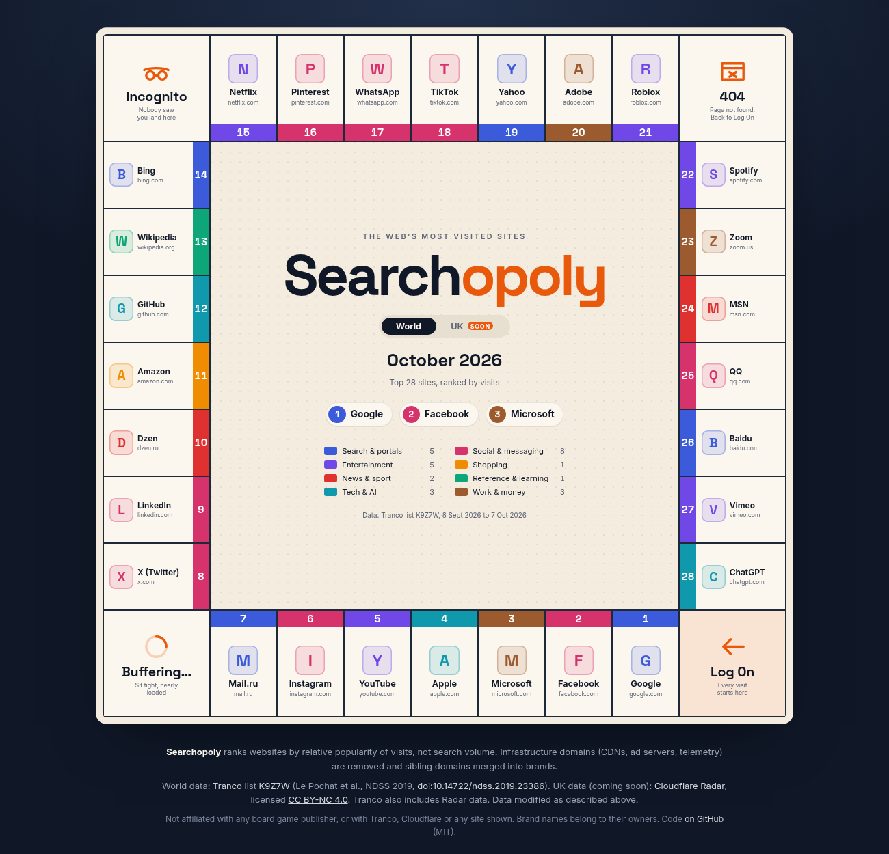
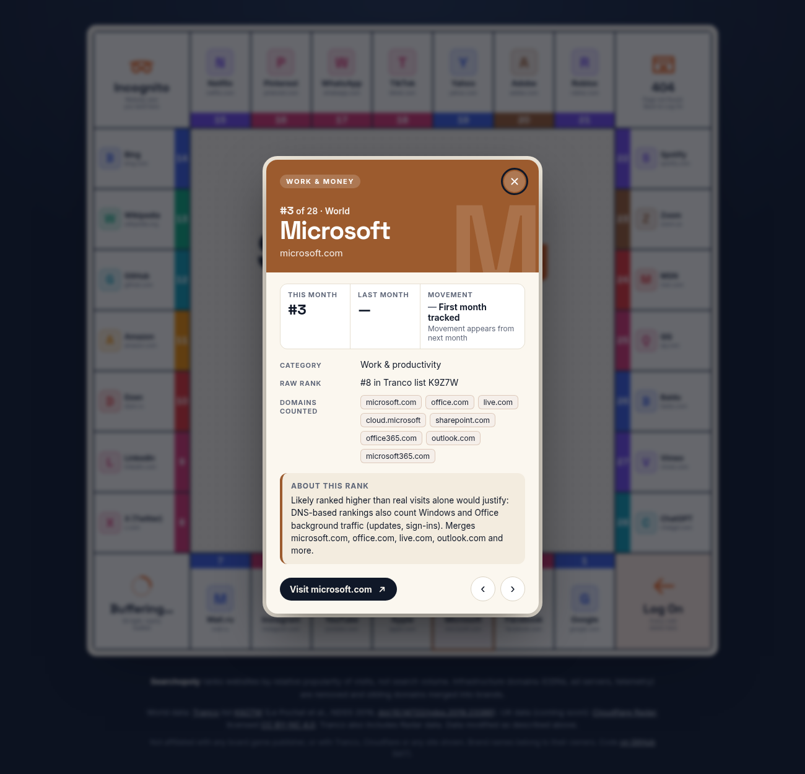
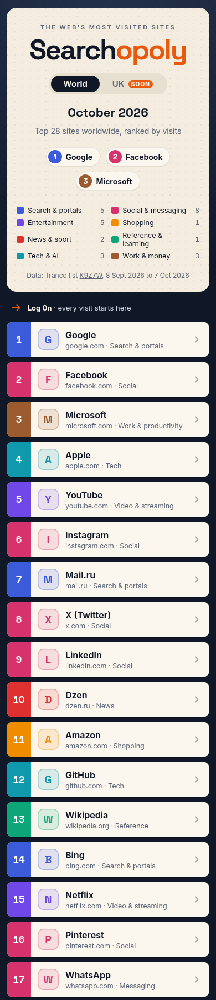

# Searchopoly

**An interactive board game-style map of the web's most visited websites, for the UK and the world, updated every month.**

Searchopoly takes public website popularity rankings, strips out the background noise
(CDNs, ad servers, telemetry), merges sibling domains into the brands people actually
recognise, and lays the top 28 out as squares on a game board. Categories are the colour
sets, and a month slider will show who climbed and who fell.

It's a data science portfolio project: the interesting part is the pipeline that turns
messy, infrastructure-heavy domain rankings into an honest, explainable list of sites.

> **Status:** milestone 3 of 5 (pipeline, interactive board, site cards, mobile layout). Month-by-month movement comes next.
> Planned home: [searchopoly.co.uk](https://searchopoly.co.uk).



<p>
  
  
</p>

## What it measures (and what it doesn't)

Searchopoly ranks sites by **relative popularity of visits**, not by search volume.
"Most searched" needs paid keyword tools; "most visited" can be estimated from free,
well-documented research rankings. Ranks are relative. Neither source publishes visitor
counts, so the board never claims numbers it can't back up.

## October 2026: World board

From [Tranco list K9Z7W](https://tranco-list.eu/list/K9Z7W) (generated 7 October 2026, covering 8 September to 7 October 2026).
`Source rank` is the brand's best position in the raw list before cleaning.

| # | Site | Category | Source rank |
|---|------|----------|-------------|
| 1 | Google | search | 1 |
| 2 | Facebook | social | 4 |
| 3 | Microsoft | productivity | 8 |
| 4 | Apple | tech | 9 |
| 5 | YouTube | video | 10 |
| 6 | Instagram | social | 11 |
| 7 | Mail.ru | search | 13 |
| 8 | X (Twitter) | social | 16 |
| 9 | LinkedIn | social | 17 |
| 10 | Dzen | news | 18 |

The full 28 are in [`data/snapshots/2026-10/world.json`](data/snapshots/2026-10/world.json).
Every one of the top 500 raw domains, and how it was treated, is in
[`world_ranked_top500.csv`](data/snapshots/2026-10/world_ranked_top500.csv).

The **UK board is pending** until a Cloudflare Radar API token is added (see below).

## How the pipeline works

```
Tranco top 5,000 ──┐                       ┌─> data/snapshots/YYYY-MM/world.json
                   ├─> classify ─> merge ──┤
Radar top 100 (GB)─┘   (map /     brands   ├─> data/snapshots/YYYY-MM/uk.json
                        exclude /  + top 28 ├─> ..._ranked_top500.csv  (transparency)
                        patterns)           └─> data/latest.json       (index for the site)
```

1. **Fetch.** The latest daily [Tranco](https://tranco-list.eu) list (World) and
   [Cloudflare Radar](https://radar.cloudflare.com/domains) top 100 for `location=GB` (UK).
   Only the first 5,000 Tranco rows are downloaded, never the full million.
2. **Classify.** Every domain is one of:
   - `mapped`: in [`pipeline/data/site_map.csv`](pipeline/data/site_map.csv), a hand-curated
     list of real destinations with brand, canonical domain and category;
   - `excluded`: in [`pipeline/data/exclude.csv`](pipeline/data/exclude.csv) (with a reason)
     or matching an infrastructure name pattern (`cdn`, `dns`, `akamai`, `googleapis` ...);
   - `unreviewed`: anything else. These never appear on a board.
3. **Merge.** Sibling domains collapse into one brand that takes its best rank:
   `google.com` + `google.co.uk` + `gmail.com` → Google; `twitter.com` + `x.com` → X;
   `office.com` + `live.com` + `outlook.com` → Microsoft.
4. **Check coverage.** If any unreviewed domain outranks the 28th site, the run warns,
   because the board might be missing a real site. The October world list is fully
   reviewed to rank 500.
5. **Write.** Small JSON files for the front end. Each site has a stable `id` (brand slug) and an
   optional `note`, plus `previous_rank` and `movement` once there's an earlier month to compare against.

### Curation rules

- **Include** a domain if people mainly reach it on purpose: typing it, opening its app or following a link.
- **Exclude** background traffic: CDNs, DNS and certificates, ad and analytics servers, app and
  device telemetry, OS update hosts, link shorteners, registrars and hosting platforms.
- **Adult sites are excluded entirely.**
- Where a brand mixes real visits with background traffic (e.g. `microsoft.com`, `apple.com`),
  it stays in. That's a known bias of DNS-based rankings, and it's documented rather than hidden.

### Categories and colour sets

18 categories roll up into 8 colour groups, defined in
[`pipeline/data/categories.csv`](pipeline/data/categories.csv):
Search & portals · Social & messaging · Entertainment · Shopping · News & sport ·
Reference & learning · Tech & AI · Work & money.

## Running it

Requires Python 3.11+ for the pipeline and Node.js 20.19+ (22 recommended) for the website.

### Data pipeline

```bash
python -m venv .venv
source .venv/bin/activate          # Windows: .venv\Scripts\activate
pip install -r requirements-dev.txt

python -m pipeline.run             # fetch, clean, write snapshots
pytest                             # run the tests
```

Options: `--month 2026-10` to label a snapshot explicitly, `--board-size 28`.

### Website

```bash
cd web
npm install
npm run dev        # local dev server at http://localhost:5173
npm run build      # production build into web/dist
npm run preview    # serve the production build
```

`npm run dev` and `npm run build` first run `scripts/copy-data.mjs`, which copies the
pipeline's JSON output from `data/` into `web/public/data/` (git-ignored). The site loads
`data/latest.json` at runtime, so a new monthly snapshot needs only a rebuild, not a code change.
The URL hash holds the state, so any view can be shared:

| URL | Shows |
|-----|-------|
| `/` or `#world` | World board |
| `#uk` | UK board ("coming soon" until `uk.json` exists) |
| `#world/google`, `#uk/bbc` | That board with a site card open (IDs are brand slugs, e.g. `x-twitter`) |

The UK board switches on automatically as soon as the pipeline writes `uk.json` and marks it
`ok` in `latest.json`. No front-end change is needed.

### Deploying to Cloudflare Pages

Connect the GitHub repo in Cloudflare Pages and use:

| Setting | Value |
|---------|-------|
| Framework preset | None |
| Root directory | *(leave blank: repo root)* |
| Build command | `npm ci --prefix web && npm run build --prefix web` |
| Build output directory | `web/dist` |
| Node version | from `.node-version` (22); or set `NODE_VERSION=22` |

The build needs no secrets: the Radar token is only used by the pipeline, never by the site.

### Enabling the UK board (Cloudflare Radar)

1. Create a free Cloudflare account, then go to **My Profile → API Tokens → Create Token →
   Custom token** and give it the **Account → Radar → Read** permission.
2. Run with the token in your environment (never commit it):
   ```bash
   export CLOUDFLARE_API_TOKEN=your_token_here
   python -m pipeline.run
   ```
Without a token the pipeline still builds the World board and marks the UK as `pending` in
`data/latest.json`. Tranco has no country split, and guessing a UK list from `.uk` domains
would be misleading (most UK traffic goes to `.com` sites), so there's no fake fallback.

## Data sources, credit and licences

| Source | Used for | Licence and attribution |
|--------|----------|-------------------------|
| [Tranco](https://tranco-list.eu) | World board | Free research ranking. Each list has a permanent ID, recorded in every snapshot. The authors ask users to cite: Victor Le Pochat, Tom Van Goethem, Samaneh Tajalizadehkhoob, Maciej Korczyński and Wouter Joosen, "Tranco: A Research-Oriented Top Sites Ranking Hardened Against Manipulation", *NDSS 2019*, [doi:10.14722/ndss.2019.23386](https://doi.org/10.14722/ndss.2019.23386). Tranco combines rankings from Cisco Umbrella, Majestic (CC BY 3.0), Farsight, the Chrome UX Report and Cloudflare Radar (CC BY-NC 4.0). |
| [Cloudflare Radar](https://radar.cloudflare.com/domains) | UK board | API data is licensed [CC BY-NC 4.0](https://creativecommons.org/licenses/by-nc/4.0/): attribution required, **non-commercial use only**, and changes must be indicated. Cloudflare's trademarks and Radar's look and feel are not licensed. |

**What this means for Searchopoly:**
- The project is non-commercial. Because Radar data is CC BY-NC (and also feeds into Tranco),
  the site shouldn't carry ads or be monetised without first checking with the data owners.
- The data has been **modified**: infrastructure domains removed, sibling domains merged and
  categories added. The method page (milestone 5) will say so alongside the credits.
- Searchopoly is not affiliated with or endorsed by Tranco, Cloudflare, or any site shown.
  Brand names belong to their owners and are used only to identify the sites.
- The board design is original. Searchopoly is not affiliated with any board game publisher.

## Roadmap

- [x] **1. Pipeline and first snapshot.** Tranco and Radar fetchers, curated cleaning, World board for October 2026, tests.
- [x] **2. Static board.** Svelte 5 + Vite. 28 squares in 8 colour sets plus 4 original corner squares, centre panel with month, top three, legend and credits; UK "coming soon" state.
- [x] **3. Interaction.** Site cards (rank, movement, category, raw rank, merged domains, notes on known biases), keyboard support, shareable URL hashes, UK/World toggle with URL state, mobile layout.
- [ ] **4. Movement.** Month slider that animates sites swapping squares (D3 transitions), plus a monthly GitHub Actions job that runs `python -m pipeline.run` and commits the new snapshot.
- [ ] **5. Launch.** "How it's made" method page with full credits, custom domain on Cloudflare Pages, share images.

## Front-end design notes

- **Board:** a 9×9 CSS grid. The 28 sites run clockwise from the **Log On** corner, 7 per side,
  so #1 sits next to the start. The other corners are **Buffering…**, **Incognito** and **404**.
  All names, icons and artwork are original.
- **Icons:** each site shows a coloured initial rather than its favicon. Loading favicons from a
  third-party service at runtime would leak visitors' data to that service and depend on its
  terms; bundling trademarked logos raises licensing questions. Initials keep the site
  self-contained, private and consistent. Locally cached favicons could be added later.
- **Fonts:** Space Grotesk and Inter (SIL Open Font License), self-hosted via Fontsource, so no
  requests go to Google Fonts.
- **No tracking, no cookies, no external requests** at runtime.
- **Site cards:** a native modal `<dialog>`. Esc or a backdrop click closes it, Tab is trapped
  inside, ←/→ step through the ranks, and focus goes back to the square that opened it. Movement
  reads "First month tracked" until a second snapshot exists, then "New this month",
  "Up 3 places" and so on. Notes come from the optional `note` column in `site_map.csv` and flag
  known biases (e.g. Windows background traffic inflating Microsoft).
- **Mobile (≤700px):** the centre panel moves to the top, followed by a ranked list that keeps the
  colour bands. Site cards open as a bottom sheet.

## Project layout

```
web/
  src/App.svelte        # loads data, footer credits
  src/lib/Board.svelte  # desktop board grid
  src/lib/CentrePanel.svelte # title, toggle, top three, legend, source
  src/lib/MobileList.svelte  # mobile ranked list
  src/lib/SiteCard.svelte    # site card dialog
  src/lib/router.js     # URL hash state
  src/lib/Square.svelte # one property square
  src/lib/Corner.svelte # the four corner squares
  src/lib/layout.js     # square positions, corner names
  src/lib/groups.js     # the 8 colour sets
  scripts/copy-data.mjs # copies data/ into the build
pipeline/
  run.py          # entry point: python -m pipeline.run
  tranco.py       # Tranco list metadata and download
  radar.py        # Cloudflare Radar ranking API client
  clean.py        # classify, merge brands, coverage check
  snapshot.py     # JSON/CSV writers and the latest.json index
  data/           # hand-curated site_map.csv, exclude.csv, categories.csv
data/
  latest.json     # index the front end loads first
  snapshots/YYYY-MM/
tests/            # pytest suite for the cleaning logic and Radar client
```

## Licence

Code: [MIT](LICENSE). Data in `data/` is derived from the sources above and remains subject
to their licences (notably CC BY-NC 4.0 for Cloudflare Radar data).
